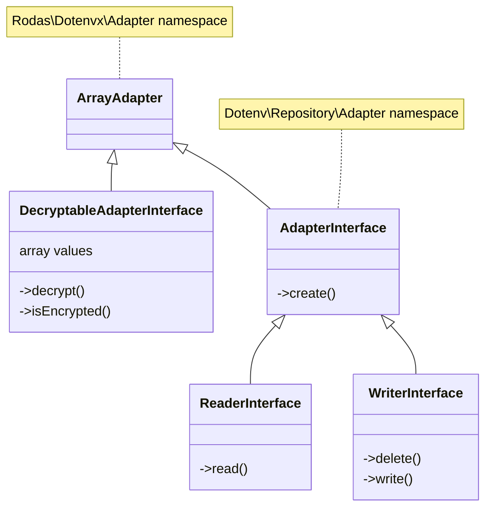

# Rodas\Dotenvx\Adapter\ArrayAdapter _(class)_

[Rodas\Dotenvx](https://github.com/Marqitos/php-dotenvx/blob/main/docs/library.md)\Adapter > **ArrayAdapter**

Read or write de values on a array,
and with the ability to decrypt its contents

See:

- [DecryptableAdapterInterface](https://github.com/Marqitos/php-dotenvx/blob/main/docs/Adapter/DecryptableAdapterInterface.md) _(interface)_
