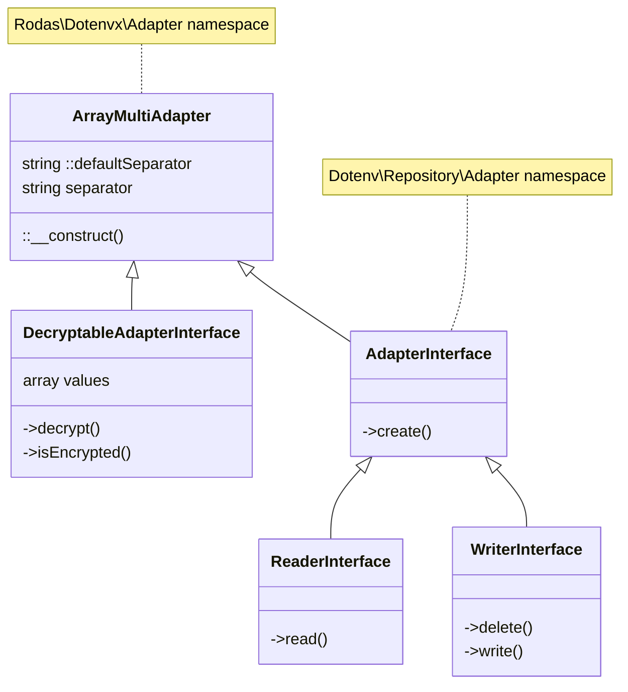

# Rodas\Dotenvx\Adapter\ArrayMultiAdapter _(class)_

[Rodas\Dotenvx](https://github.com/Marqitos/php-dotenvx/blob/main/docs/library.md)\Adapter > **ArrayMultiAdapter**

Read or write de values on a multilevel array,
and with the ability to decrypt its contents



## Properties

### defaultSeparator

Char to split the name into keys, for use with self::create().

```php
static string $defaultSeparator
```

### separator

Get the char to split the name into keys.

```php
array $separator { get; }
```

## Methods

Create a new array multi-level adapter instance.

### __construct

```php
function __construct(string $separator)
```

- `@param string $separator` Char to split the name into keys
- `@return ArrayMultiAdapter`

---

See:

- [DecryptableAdapterInterface](https://github.com/Marqitos/php-dotenvx/blob/main/docs/Adapter/DecryptableAdapterInterface.md) _(interface)_
