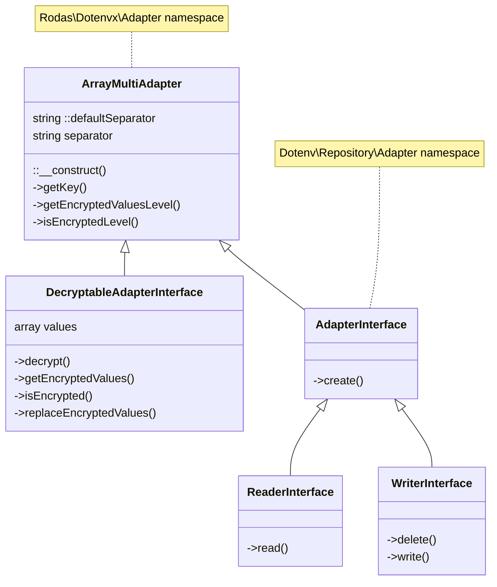

# Rodas\Dotenvx\Adapter\ArrayMultiAdapter _(class)_

[Rodas\Dotenvx](https://github.com/Marqitos/php-dotenvx/blob/main/docs/library.md)\Adapter > **ArrayMultiAdapter**

Read or write de values on a multilevel array,
and with the ability to decrypt its contents



## Properties

### defaultSeparator

Char to split the name into keys, for use with self::create().

```php
static string $defaultSeparator
```

### separator

Get the char to split the name into keys.

```php
array $separator { get; }
```

## Methods

### __construct

Create a new array multi-level adapter instance.

```php
function __construct(string $separator)
```

- `@param string $separator` Char to split the name into keys

### getKey

```php
function getKey(array $names): string
```

- `@param array<string> $names`
- `@return string`

### getEncryptedValuesLevel

```php
function getEncryptedValuesLevel(array $xPath = []): array
```

- `@param array<string>  $xPath`
The path to the values to decrypt within the ArrayMultiAdapter instance.
- `@return array<string>`
All encrypted values as base64 encoded strings of the selected an children levels.

### isEncryptedLevel

```php
function isEncryptedLevel(array $xPath = []): bool
```

- `@param  array<string> $xPath`
The path to the values to decrypt within the ArrayMultiAdapter instance.
- `@return bool`
If encrypted values are found, otherwise false.

---

See:

- [DecryptableAdapterInterface](https://github.com/Marqitos/php-dotenvx/blob/main/docs/Adapter/DecryptableAdapterInterface.md) _(interface)_
