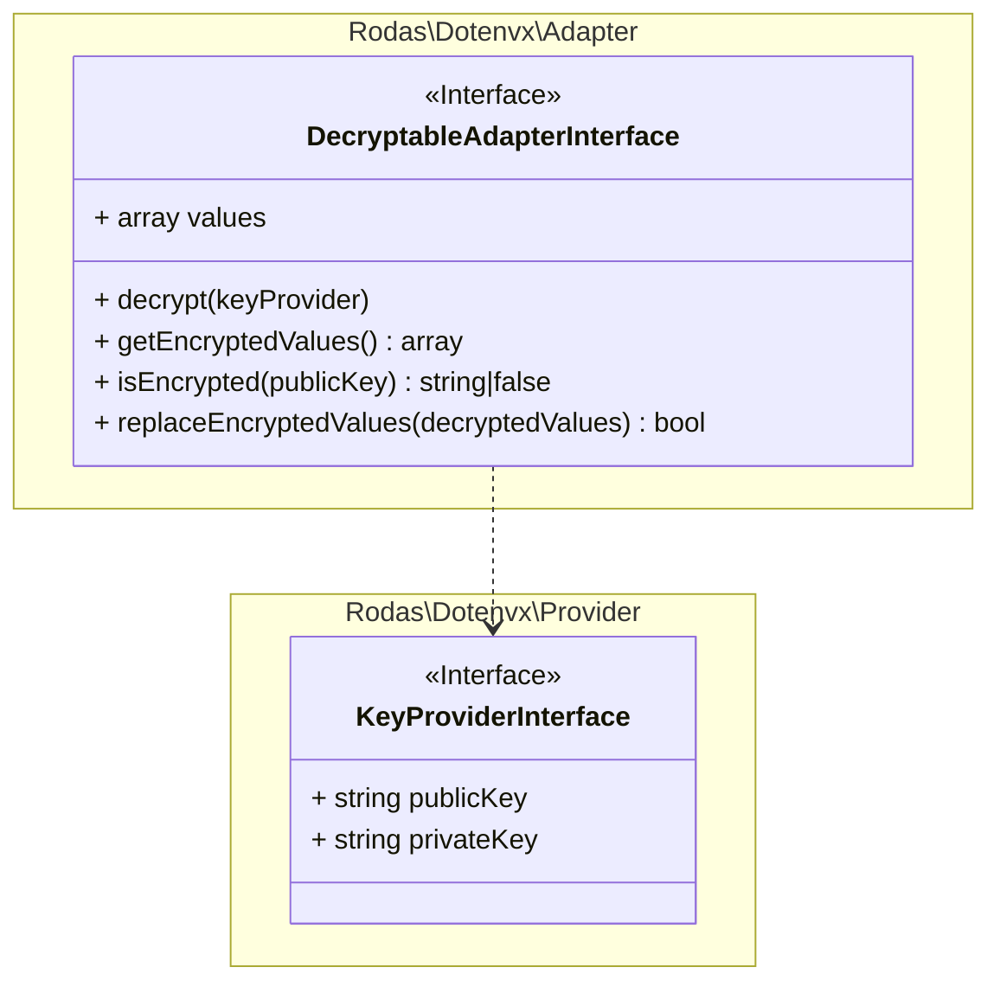

# Rodas\Dotenvx\Adapter\DecryptableAdapterInterface _(interface)_

[Rodas\Dotenvx](https://github.com/Marqitos/php-dotenvx/blob/main/docs/library.md)\Adapter > **DecryptableAdapterInterface**

Represents an adapter that can contain encrypted values



## Properties

### values

Gets the stored values

```php
array $values { get; }
```

## Methods

### decrypt

Decrypt all encrypted values.

```php
use Rodas\Dotenvx\Provider\KeyProviderInterface

function decrypt(#[SensitiveParameter] KeyProviderInterface $keyProvider): void
```

- `@param  KeyProviderInterface $keyProvider` Keys used for decryption.
- `@return void`

### getEncryptedValues

Return all encrypted values as base64 encoded strings.

```php
function function getEncryptedValues(): array
```

- `@return array<string>`
All encrypted values as base64 encoded strings.

### isEncrypted

Return if contains encrypted values, and there is a public key.

```php
function isEncrypted(?string $publicKey = null): string|false
```

- `@param  ?string              $publicKey`
(Optional) The public key used for encryption.
- `@return string|false`
The public key if encrypted values are found, otherwise false.
- `@throws RuntimeException`
If there isn't public key when encrypted values exist.

### replaceEncryptedValues

Replace encrypted values with decrypted values.

```php
function replaceEncryptedValues(#[SensitiveParameter] array $decryptedValues): bool
```

- `@param  array<string, mixed> $values`
Decrypted values, encrypted values as keys.
- `@return bool`
Still contains encrypted values after replacement.

---

See:

- [KeyProviderInterface](https://github.com/Marqitos/php-dotenvx/blob/main/docs/Adapter/KeyProviderInterface.md) _(interface)_
