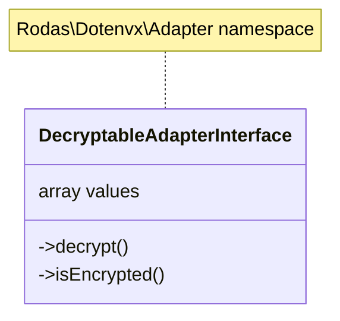

# Rodas\Dotenvx\Adapter\DecryptableAdapterInterface _(interface)_

[Rodas\Dotenvx](https://github.com/Marqitos/php-dotenvx/blob/main/docs/library.md)\Adapter > **DecryptableAdapterInterface**

Represents an adapter that can contain encrypted values



## Properties

### values

Gets de stored values

```php
array $values { get; }
```

## Methods

### decrypt

Decrypt all encrypted values.

```php
use Rodas\Dotenvx\Provider\KeyProviderInterface

function decrypt(#[SensitiveParameter] KeyProviderInterface $keyProvider): void
```

- `@param  KeyProviderInterface $keyProvider` Keys used for decryption.
- `@return void`

### isEncrypted

Return if contains encrypted values, and there is a public key

```php
function isEncrypted(?string $publicKey = null): string|false
```

- `@param  ?string              $publicKey`
(Optional) The public key used for encryption.
- `@return string|false`
The public key if encrypted values are found, otherwise false.
- `@throws RuntimeException`
If there isn't public key when encrypted values exist.

---

See:

- [KeyProviderInterface](https://github.com/Marqitos/php-dotenvx/blob/main/docs/Adapter/KeyProviderInterface.md) _(interface)_
