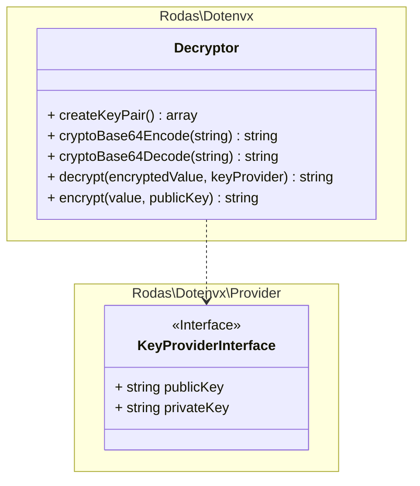

# Rodas\Dotenvx\Decryptor _(class)_

[Rodas\Dotenvx](https://github.com/Marqitos/php-dotenvx/blob/main/docs/library.md) > **Decryptor**

Provide Montgomery curve, Curve25519, encryption functions.
(Usually abbreviated as X25519)

Same cryptography as Bitcoin

- Require ext-sodium _(or sodium polyfill)_
- Is a Singleton class



## Methods

All methods are static.

### createKeyPair

```php
static function createKeyPair(): array
```

Return a private key and a public key pair of X25519 in base64

- `@return array[string privateKey, string publicKey]` Keys base64 encoded.

### cryptoBase64Encode

Converts a raw binary string into a base64-encoded string (constant-time mode).

```php
static function cryptoBase64Encode(string $string): string
```

- `@param  string $string` Decoded/raw binary string.
- `@return string`         Base64 string.

### cryptoBase64Decode

Converts a base64 encoded string into raw binary (constant-time mode).

```php
static function cryptoBase64Decode(string $string): string
```

- `@param  string $string` Base64 string.
- `@return string`         Decoded/raw binary string.

### decrypt

Decrypts a value using the provided keys.

```php
use Rodas\Dotenvx\Provider\KeyProviderInterface;

static function decrypt(string $encryptedValue, #[SensitiveParameter] KeyProviderInterface $keyProvider): string
```

- `@param  string               $encryptedValue` The encrypted value to decrypt.
- `@param  KeyProviderInterface $keyProvider`    Keys used for decryption.
- `@return string`                               The decrypted value.
- `@throws Exception`                            If the decryption fails.

### encrypt

Encrypts a value using the provided public key.

```php
static function encrypt(#[SensitiveParameter] string $value, string $publicKey): string
```

- `@param  string $value`     The value to encrypt.
- `@param  string $publicKey` The public key used for encryption.
- `@return string`            The encrypted value.
