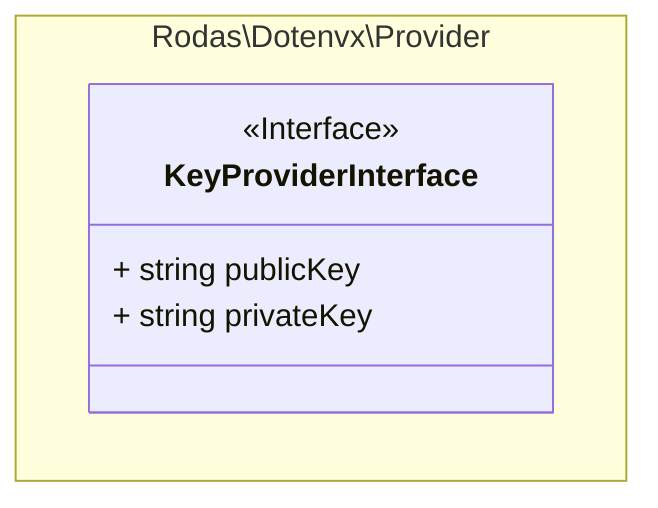

# Rodas\Dotenvx\Adapter\DecryptableAdapterInterface _(interface)_

[Rodas\Dotenvx](https://github.com/Marqitos/php-dotenvx/blob/main/docs/library.md)\Provider > **DecryptableAdapterInterface**

Represents an adapter that can contain encrypted values



## Properties

### publicKey

Get the public key

```php
string $publicKey { get; }
```

### privateKey

Get the private key

```php
string $privateKey { get; }
```
