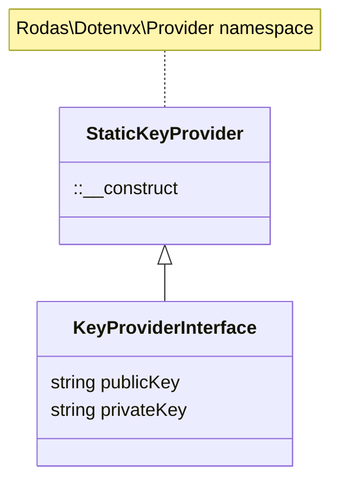

# Rodas\Dotenvx\Adapter\StaticKeyProvider _(class)_

[Rodas\Dotenvx](https://github.com/Marqitos/php-dotenvx/blob/main/docs/library.md)\Provider > **StaticKeyProvider**

Represents an adapter that can contain encrypted values



## Methods

### decrypt

Decrypt all encrypted values.

```php
function __construct(string $publicKey,#[SensitiveParameter] string $privateKey)
```

- `@param string $publicKey`  Encryption public key.
- `@param string $privateKey` Decryption public key.
- `@return StaticKeyProvider`

---

See:

- [KeyProviderInterface](https://github.com/Marqitos/php-dotenvx/blob/main/docs/Adapter/KeyProviderInterface.md) _(interface)_
