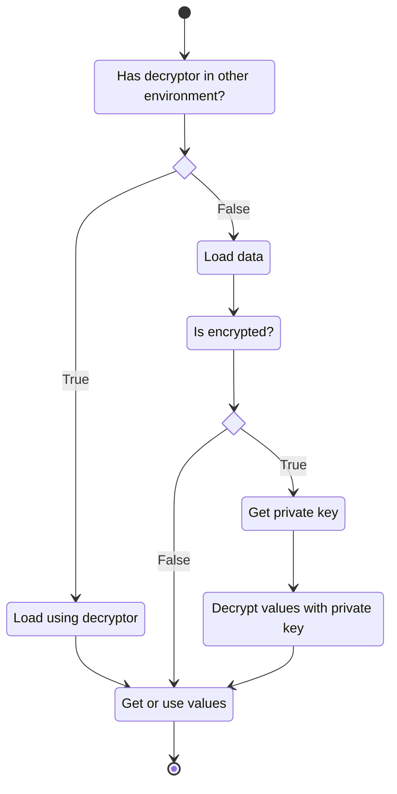

# Rodas\Dotenvx library usage

[Library files and description](https://github.com/Marqitos/php-dotenvx/blob/main/docs/library.md)

## Example



```php
// Decryptor signature
function decrypt(string $publicKey, array $encryptedValues): array;

// Load using decryptor
$arrayAdapter       = new ArrayAdapter();
$repository         = RepositoryBuilder::createWithNoAdapters()
    ->addAdapter($arrayAdapter)
    ->make();
Dotenvx::create($repository, __DIR__)->loadEncrypted('decrypt');

// Get or use values
$options            = $arrayAdapter->values;
```
