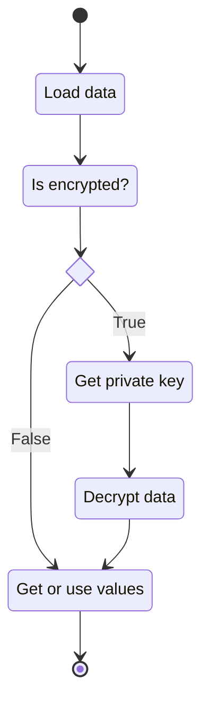

# Rodas\Dotenvx library usage

[Library files and description](https://github.com/Marqitos/php-dotenvx/blob/main/docs/library.md)

## Example



```php
// Load data
$arrayAdapter       = new ArrayAdapter();
$repository         = RepositoryBuilder::createWithNoAdapters()
    ->addAdapter($arrayAdapter)
    ->make();
Dotenv::create($repository, __DIR__, '.env')->load();

// Is encrypted?
$publicKey          = $arrayAdapter->isEncrypted();
$arrayAdapter->delete('DOTENV_PUBLIC_KEY');
if (is_string($publicKey)) {

    // Find private key
    // Don't make this in production
    $repository         = RepositoryBuilder::createWithNoAdapters()
        ->addAdapter(ArrayAdapter::class)
        ->make();
    $privateData        = Dotenv::create($repository, __DIR__, '.env.key')->load();
    $privateKey         = $privateData['DOTENV_PRIVATE_KEY'];

    // Decrypt data
    $staticKeyProvider  = new StaticKeyProvider($publicKey, $privateKey);
    $arrayAdapter->decrypt($staticKeyProvider);

    unset($repository, $privateData, $privateKey, $staticKeyProvider) 
}

// Get or use values
$options            = $arrayAdapter->values;
```
